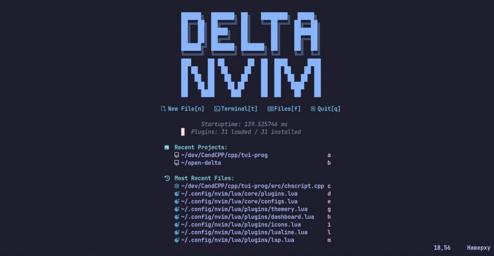

# DeltaNvim
### моя сборка консольного редактора неовим,  для работы с языками Си, Раст, АСМ и linker script
------------------------------------------------------------------------------------------

--------------------------------------------------------------------------------------------

# Версия неовима: v0.11.6

---------------------------------------------------------------------------------------------

# Проблемы с lsp на других дистрибутивах linux.
### Бывает такое что из-за того что версии разные, плагин для lsp не ставится и вылетают ошибки, в этом случае как по мне можно поставить lsp через mason ведь даже если вылетят ошибки при его установки он сможет работать при перезапуске редактора.

----------------------------------------------------------------------------------------------

# Почему именно тема catppuccin?
### Я попробовал на себе около 10 цветовых схем для терминала и редактора в том числе и при запуске плагина Themery.nvim по alt+t можно увидеть мой топ цветовых схем которые можно конечно же попробовать. 
### Тема catppuccin mocha мне очень понравилась, приятные тёмные и светлые цвета по идее идеальная колорсхема которая очень сильно захайпилась. У них есть свой репозиторий где можно посмотреть как поставить их колорсхема на около 300 приложений и утилит. 

---------------------------------------------------------------------------------------------

# Где поддержка других языков? хотите ставьте сами.

---------------------------------------------------------------------------------------------

# скриншотики будут в папке с названием screenshots.
